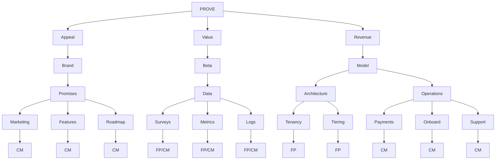

# Loca Hardening Sprint

## PROVE Strategic Framework

## 5-Day Sprint Board

| Day | In | To Do | Tools | Out | Milestone |
|-----|----|----|-------|-----|-----------|
| 1 | How does it all work? | Read docs, Read code, Ask CM/LZ | Access to R.A.O.L, Figma, Claude Code, Clip | Narratives & 3 diagram set | [Day 1](../../milestone/1) |
| 2 | How might we harden the current state? | Read Replit docs, Ask CM/33 create test env | Access to all + Access to create/clone | Replit configuration, playbooks KB | [Day 2](../../milestone/2) |
| 3 | How might we make it easy to work on? | Clean up pipeline, test, reconfig AI, add Replit features | Claude code, pipeline, access to all, Replit features | Clean code, consolidated prompts, KB, Replit features | [Day 3](../../milestone/3) |
| 4 | How might we make it usable for groups/individuals? & capture usage | Set up users, set up groups, refactor code/DB, config dashboard | Replit, Neon, Claude Code, Dashboard tool | Refactor for tenancy & tiering & on/offboard tools | [Day 4](../../milestone/4) |
| 5 | How might we sell it? & support | Setup payments, link tiering, setup UX | Replit, Claude Code, Neon, Payment tool | Payments, support | [Day 5](../../milestone/5) |

## Epics

| Epic | Points | Scope | Stories | GitHub Issue |
|------|--------|-------|---------|--------------|
| Multi-tenancy | 12 | Build and Spec | 8 stories | [Epic #1](../../issues/1) |
| Multi-environment | 16 | Spec | 4 stories | [Epic #2](../../issues/2) |
| Payment and Subscriptions | 7 | Spec | 3 stories | [Epic #3](../../issues/3) |

**Total Points:** 35

## Testing Milestone

All testing activities are organized under the [Testing Milestone](../../milestone/6) with the following test epics:

- [Feature Tests Epic](../../issues/4)
- [Web Tests Epic](../../issues/5)
- [API Tests Epic](../../issues/6)
- [AI Tests Epic](../../issues/7)
- [Database Tests Epic](../../issues/8)

## Additional Documentation

- [Team Norms](./docs/NORMS.md)
- [How Might We](./docs/HOW_MIGHT_WE.md)
- [Day 1 Questions](./day-1/QUESTIONS.md)
- [Day 1 Goals](./day-1/GOALS.md)

## Key Abbreviations

- **CM**: Christian Markow
- **FP**: Ford Prior
- **KB**: Knowledge Base
- **UX**: User Experience
- **JWT**: JSON Web Token
- **SSE**: Server-Sent Events
