# Loca Hardening Sprint

## PROVE Strategic Framework


## 5-Day Sprint Board

| Day | In | To Do | Tools | Out | Milestone |
|-----|----|----|-------|-----|-----------|
| 1 | How does it all work? | Read docs, Read code, Ask CM/LZ | Access to R.A.O.L, Figma, Claude Code, Clip | Narratives & 3 diagram set | [Day 1](../../milestone/1) |
| 2 | How might we harden the current state? | Read Replit docs, Ask CM/33 create test env | Access to all + Access to create/clone | Replit configuration, playbooks KB | [Day 2](../../milestone/2) |
| 3 | How might we make it easy to work on? | Clean up pipeline, test, reconfig AI, add Replit features | Claude code, pipeline, access to all, Replit features | Clean code, consolidated prompts, KB, Replit features | [Day 3](../../milestone/3) |
| 4 | How might we make it usable for groups/individuals? & capture usage | Set up users, set up groups, refactor code/DB, config dashboard | Replit, Neon, Claude Code, Dashboard tool | Refactor for tenancy & tiering & on/offboard tools | [Day 4](../../milestone/4) |
| 5 | How might we sell it? & support | Setup payments, link tiering, setup UX | Replit, Claude Code, Neon, Payment tool | Payments, support | [Day 5](../../milestone/5) |

## Epics

| Epic | Points | Scope | Stories | GitHub Issue |
|------|--------|-------|---------|--------------|
| Multi-tenancy | 12 | Build and Spec | 8 stories | [Epic #1](../../issues/1) |
| Multi-environment | 16 | Spec | 4 stories | [Epic #2](../../issues/2) |
| Payment and Subscriptions | 7 | Spec | 3 stories | [Epic #3](../../issues/3) |

**Total Points:** 35

## Testing Milestone

All testing activities are organized under the [Testing Milestone](../../milestone/6) with the following test epics:

- [Feature Tests Epic](../../issues/4)
- [Web Tests Epic](../../issues/5)
- [API Tests Epic](../../issues/6)
- [AI Tests Epic](../../issues/7)
- [Database Tests Epic](../../issues/8)

## Additional Documentation

- [Team Norms](./docs/NORMS.md)
- [How Might We](./docs/HOW_MIGHT_WE.md)
- [Day 1 Questions](./day-1/QUESTIONS.md)
- [Day 1 Goals](./day-1/GOALS.md)

## Key Abbreviations

- **CM**: Christian Markow
- **FP**: Ford Prior
- **KB**: Knowledge Base
- **UX**: User Experience
- **JWT**: JSON Web Token
- **SSE**: Server-Sent Events

# AI Intelligence Platform
## Executive Technical Summary

### 🏗️ **Infrastructure Overview**

**Hosting:** Repl.it (single production environment)  
**Deployment:** Preview-to-production pipeline (CEO-managed)  
**Current Limitations:** No backups, logging, monitoring, or rollback capability

---

### 🎯 **Product Portfolio**

#### **Primary Focus: Troublemaker**
*30-minute strategic intelligence engine*

**Core Value Proposition:** Transforms business context into bespoke market research reports through AI-powered external data synthesis and Socratic dialogue refinement.

**User Journey:**
```
Chat Initiation → AI Intelligence Gathering → Report Generation → 
Interactive Highlighting → Socratic Analysis → Business Concepts
```

#### **Secondary Product: Centarchetype**
*Brand personality and content generation platform*

**Function:** Socratic dialogue-driven brand definition with aligned copywriting and editing capabilities.

---

### 🔧 **Technical Architecture**

#### **Frontend Stack (React)**
| Component | Purpose |
|-----------|---------|
| Chat Interface | AI conversation hub |
| Authentication | User management |
| Document Uploader | Content ingestion |
| Reports Dashboard | Intelligence visualization |
| Navigation Suite | UX framework |

**State Management:** Zustand (local) + TanStack Query (server sync)

#### **API Infrastructure (Node/Express)**

**Five Microservice Groups:**

1. **🤖 AI Tools** — OpenAI Assistants API integration (GPT-5, Opus)
2. **🔐 Authentication** — User account operations  
3. **📁 Projects & Workstreams** — Project lifecycle management
4. **📄 Content Management** — Upload and usage tracking
5. **📊 Reports** — Generation, highlighting, annotations

#### **Data Architecture (Neon PostgreSQL)**

**Core Relationships:**
```
Users → Memory
Users → Projects → Workstreams → Reports
Reports → Highlights + Annotations
Content Folders → Content Files → Usage Mapping
```

**Vector Store Integration:**
- Conversations ↔ ConversationMessages
- VectorStore ↔ DocChunks (embeddings)

---

### ⚠️ **Current Challenges**

#### **Technical Debt**
- Chat memory persistence issues
- Performance bottlenecks in report generation
- Single-point-of-failure deployment model

#### **Infrastructure Gaps**
- Automated testing framework
- Centralized prompt management
- Multi-tenancy architecture
- Subscription and payment processing

#### **Product Development**
- Centarchetype architectural mapping incomplete
- Context building inefficiencies
- Generation speed optimization needed

---

### 🚀 **Strategic Roadmap**

**Immediate Priorities:**
- Troublemaker optimization and bug resolution
- Centarchetype architecture definition
- Performance enhancement initiatives

**Future Development:**
- Three additional product launches
- Enterprise-grade infrastructure migration
- Comprehensive monitoring and backup systems

---

### 🏛️ **System Architecture**

```mermaid
graph TB
    subgraph "Frontend Layer (React)"
        Chat[🗨️ Chat Interface]
        Auth[🔐 Authentication]
        DocUp[📤 Doc Uploader]
        Reports[📊 Reports View]
        Nav[🧭 Navigation]
        
        subgraph "State Management"
            Zustand[📦 Zustand<br/>Local Storage]
            TanStack[🔄 TanStack Query<br/>Server Sync]
        end
    end
    
    subgraph "API Layer (Node/Express)"
        AITools[🤖 AI Tools API]
        AuthAPI[🔐 Auth API]
        Projects[📁 Projects & Workstreams API]
        Content[📄 Content Management API]
        ReportsAPI[📊 Reports API]
    end
    
    subgraph "External Services"
        OpenAI[🧠 OpenAI Assistants<br/>GPT-5, Opus]
        WebData[🌐 External Intelligence<br/>Web Data Sources]
    end
    
    subgraph "Data Layer (Neon PostgreSQL)"
        subgraph "Core Tables"
            Users[(👤 Users)]
            Memory[(🧠 Memory)]
            ProjectsDB[(📁 Projects)]
            Workstreams[(📋 Workstreams)]
            ReportsDB[(📊 Reports)]
            Highlights[(✨ Highlights)]
            Annotations[(📝 Annotations)]
            ContentFolders[(📂 Content Folders)]
            ContentFiles[(📄 Content Files)]
            ContentUsage[(📈 Content Usage)]
        end
        
        subgraph "Vector Stores"
            Conversations[(💬 Conversations)]
            ConversationMessages[(💭 ConversationMessages)]
            VectorStore[(🎯 VectorStore)]
            DocChunks[(📋 DocChunks)]
        end
    end
    
    subgraph "Products"
        Troublemaker[🔍 Troublemaker<br/>Market Research Engine]
        Centarchetype[🎨 Centarchetype<br/>Brand Definition Platform]
    end
    
    %% Frontend Connections
    Chat --> AITools
    Auth --> AuthAPI
    DocUp --> Content
    Reports --> ReportsAPI
    Nav --> Projects
    
    %% API Connections
    AITools --> OpenAI
    AITools --> WebData
    AITools --> VectorStore
    AITools --> Conversations
    AuthAPI --> Users
    Projects --> ProjectsDB
    Projects --> Workstreams
    Content --> ContentFolders
    Content --> ContentFiles
    ReportsAPI --> ReportsDB
    ReportsAPI --> Highlights
    ReportsAPI --> Annotations
    
    %% Database Relationships
    Users --> Memory
    Users --> ProjectsDB
    ProjectsDB --> Workstreams
    Workstreams --> ReportsDB
    ReportsDB --> Highlights
    ReportsDB --> Annotations
    ContentFolders --> ContentFiles
    ContentFiles --> ContentUsage
    Conversations --> ConversationMessages
    VectorStore --> DocChunks
    
    %% Product Connections
    Troublemaker -.-> Chat
    Troublemaker -.-> Reports
    Centarchetype -.-> Chat
    
    %% Styling
    classDef frontend fill:#e1f5fe
    classDef api fill:#f3e5f5
    classDef database fill:#e8f5e8
    classDef external fill:#fff3e0
    classDef product fill:#fce4ec
    
    class Chat,Auth,DocUp,Reports,Nav,Zustand,TanStack frontend
    class AITools,AuthAPI,Projects,Content,ReportsAPI api
    class Users,Memory,ProjectsDB,Workstreams,ReportsDB,Highlights,Annotations,ContentFolders,ContentFiles,ContentUsage,Conversations,ConversationMessages,VectorStore,DocChunks database
    class OpenAI,WebData external
    class Troublemaker,Centarchetype product
```



### 💡 **Next Actions**

**Architectural Integration:** The diagram above illustrates component relationships, API integrations, and database schema for seamless Centarchetype integration planning and system optimization.
