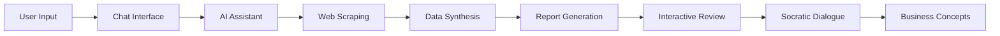
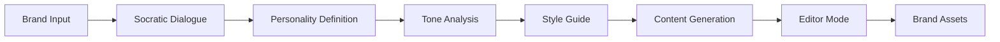

# 🏗️ Platform Architecture - Detailed Documentation

## Executive Summary

The LOCA platform is an AI-powered intelligence system hosted entirely on Repl.it, operating with a single production environment. The system currently lacks critical infrastructure components including backups, monitoring, and multi-tenancy, while serving two primary products: **Troublemaker** (strategic intelligence) and **Centarchetype** (brand personality).

---

## 🌐 Infrastructure Overview

### Current State
- **Hosting Platform**: Repl.it (100% dependency)
- **Environment**: Single production instance
- **Deployment Method**: Preview-to-production button (CEO-managed)
- **Infrastructure-as-Code**: None
- **Disaster Recovery**: None
- **Monitoring**: None
- **Backups**: None

### Critical Gaps
| Component | Current State | Required State |
|-----------|--------------|----------------|
| Environments | Production only | Dev/Staging/Prod |
| Backups | None | Automated daily |
| Monitoring | None | Full observability |
| Logging | Basic | Centralized logging |
| Rollback | Unreliable | Version control |
| Multi-tenancy | None | Full isolation |
| Authentication | Basic | Scoped & tiered |
| Payments | None | Subscription system |

---

## 🎨 Frontend Architecture (React)

### Technology Stack
- **Framework**: React 18
- **Build Tool**: Vite (with HMR - Hot Module Replacement)
- **State Management**: 
  - **Zustand**: Local state management
  - **TanStack Query**: Server state synchronization & caching
- **Styling**: PostCSS
- **Routing**: React Router v6

### Component Architecture

```
src/
├── components/
│   ├── Chat/              # AI conversation interface
│   ├── Auth/              # User authentication
│   ├── DocUploader/       # Document ingestion
│   ├── Reports/           # Intelligence reports
│   └── Navigation/        # App navigation
├── stores/                # Zustand stores
├── hooks/                 # Custom React hooks
├── api/                   # API client layer
└── utils/                 # Utility functions
```

### Core Components

#### 1. Chat Interface
- Real-time AI conversation
- Context persistence (buggy)
- Message threading
- Socratic dialogue support

#### 2. Authentication System
- User registration/login
- Session management
- Token refresh
- Account management

#### 3. Document Uploader
- Drag-and-drop interface
- File type validation
- Progress tracking
- Batch upload support

#### 4. Reports Dashboard
- Report generation UI
- Interactive highlighting
- Annotation system
- Export functionality

#### 5. Navigation Suite
- Responsive layout
- Menu system
- Breadcrumbs
- User preferences

---

## 🔧 API Layer (Node.js/Express)

### Architecture Pattern
Microservice-oriented architecture with 5 distinct service groups:

### Service Groups

#### 1. AI Tools Service
**Purpose**: OpenAI integration and vector management

**Endpoints**:
- `POST /api/ai/chat` - Initiate AI conversation
- `POST /api/ai/generate` - Generate reports
- `GET /api/ai/context` - Retrieve conversation context
- `POST /api/ai/vectors` - Manage embeddings

**Integration Points**:
- OpenAI Assistants API
- GPT-5 and Claude Opus models
- Vector store management
- Embedding generation

#### 2. Authentication Service
**Purpose**: User account operations

**Endpoints**:
- `POST /api/auth/register`
- `POST /api/auth/login`
- `POST /api/auth/refresh`
- `POST /api/auth/logout`
- `GET /api/auth/profile`

**Features**:
- JWT token management
- Session handling
- Password hashing (bcrypt)
- Rate limiting

#### 3. Projects & Workstreams Service
**Purpose**: Project lifecycle management

**Endpoints**:
- `CRUD /api/projects`
- `CRUD /api/projects/:id/workstreams`
- `GET /api/workstreams/:id/reports`

**Data Model**:
```
User → Projects → Workstreams → Reports
```

#### 4. Content Management Service
**Purpose**: Document handling and tracking

**Endpoints**:
- `POST /api/content/upload`
- `GET /api/content/folders`
- `GET /api/content/files`
- `POST /api/content/usage`

**Features**:
- File storage management
- Usage analytics
- Content organization
- Access control

#### 5. Reports Service
**Purpose**: Intelligence report operations

**Endpoints**:
- `POST /api/reports/generate`
- `GET /api/reports/:id`
- `POST /api/reports/:id/highlights`
- `POST /api/reports/:id/annotations`

**Features**:
- Async generation
- Real-time updates
- Collaborative annotations
- Export formats

### Middleware Stack
```javascript
app.use(cors());
app.use(helmet());
app.use(compression());
app.use(express.json({ limit: '50mb' }));
app.use(rateLimiter);
app.use(authMiddleware);
app.use(errorHandler);
```

---

## 💾 Data Layer (PostgreSQL)

### Database Provider
- **Service**: Neon Managed PostgreSQL
- **ORM**: DrizzleORM
- **Connection Pooling**: PgBouncer
- **Region**: Single region deployment

### Schema Design

#### Core Tables (10 Total)

##### User Management
```sql
Users
├── id (UUID, PK)
├── email (unique)
├── password_hash
├── created_at
└── updated_at

Memory (User-specific storage)
├── id (UUID, PK)
├── user_id (FK → Users)
├── key
├── value (JSONB)
└── updated_at
```

##### Project Hierarchy
```sql
Projects
├── id (UUID, PK)
├── user_id (FK → Users)
├── name
├── description
└── created_at

Workstreams
├── id (UUID, PK)
├── project_id (FK → Projects)
├── name
└── status

Reports
├── id (UUID, PK)
├── workstream_id (FK → Workstreams)
├── content (TEXT)
├── metadata (JSONB)
└── generated_at
```

##### Report Features
```sql
Highlights
├── id (UUID, PK)
├── report_id (FK → Reports)
├── text
├── position (JSONB)
└── created_at

Annotations
├── id (UUID, PK)
├── report_id (FK → Reports)
├── highlight_id (FK → Highlights)
├── content
└── author_id (FK → Users)
```

##### Content Management
```sql
ContentFolders
├── id (UUID, PK)
├── name
├── parent_id (self-reference)
└── user_id (FK → Users)

ContentFiles
├── id (UUID, PK)
├── folder_id (FK → ContentFolders)
├── filename
├── size
└── mime_type

ContentUsage
├── id (UUID, PK)
├── file_id (FK → ContentFiles)
├── context_type
├── context_id
└── used_at
```

### Vector Store Architecture

#### Dedicated Vector Tables
```sql
Conversations
├── id (UUID, PK)
├── user_id (FK → Users)
├── thread_id (OpenAI)
└── metadata (JSONB)

ConversationMessages
├── id (UUID, PK)
├── conversation_id (FK → Conversations)
├── role (user/assistant)
├── content
└── timestamp

VectorStore
├── id (UUID, PK)
├── namespace
├── metadata (JSONB)
└── created_at

DocChunks
├── id (UUID, PK)
├── vector_store_id (FK → VectorStore)
├── content
├── embedding (vector(1536))
└── metadata (JSONB)
```

---

## 🤖 AI Integration Architecture

### OpenAI Assistants API

#### Configuration
```javascript
{
  model: "gpt-4-turbo-preview",
  tools: ["retrieval", "code_interpreter"],
  file_ids: [...],
  metadata: {
    product: "troublemaker|centarchetype"
  }
}
```

#### Assistant Management
- **Troublemaker Assistant**: Market research and intelligence
- **Centarchetype Assistant**: Brand personality and content
- **Shared Context**: Cross-product memory (planned)

### Vector Store Management

#### Embedding Pipeline
1. Document ingestion
2. Text chunking (1000 tokens)
3. Embedding generation (text-embedding-3-large)
4. Vector storage
5. Similarity search

#### Retrieval Strategy
- **Hybrid search**: Keyword + semantic
- **Re-ranking**: Cross-encoder model
- **Context window**: 8K tokens
- **Top-K**: 10 results

---

## 🚀 Product Architectures

### Troublemaker - Intelligence Engine

#### System Flow


#### Key Components
1. **Intelligence Gathering**
   - Web scraping engine
   - API integrations
   - Data normalization

2. **Report Generation**
   - Template engine
   - Markdown processing
   - PDF export

3. **Interactive Analysis**
   - Highlight detection
   - Context extraction
   - Dialogue management

### Centarchetype - Brand Platform

#### System Flow


#### Components (Planned/Partial)
1. **Brand Definition**
   - Questionnaire system
   - Personality mapping
   - Tone calibration

2. **Content Generation**
   - Copy templates
   - Style enforcement
   - A/B variations

3. **Editorial Tools**
   - Grammar checking
   - Brand compliance
   - Version control

---

## ⚠️ Known Issues & Technical Debt

### Critical Issues

#### 1. Memory & Context
- **Problem**: Chat sessions lose context intermittently
- **Impact**: User frustration, repeated inputs
- **Root Cause**: Inefficient session storage
- **Solution**: Implement Redis cache layer

#### 2. Performance Bottlenecks
- **Problem**: Report generation takes 5-10 minutes
- **Impact**: User drop-off
- **Root Cause**: Synchronous processing
- **Solution**: Queue-based async architecture

#### 3. Single Point of Failure
- **Problem**: One production instance
- **Impact**: Total system outage risk
- **Root Cause**: No redundancy
- **Solution**: Multi-region deployment

### Technical Debt Registry

| Component | Debt Type | Priority | Estimated Effort |
|-----------|-----------|----------|------------------|
| Chat Memory | Architecture | High | 2 weeks |
| Report Gen | Performance | High | 1 week |
| Auth System | Security | High | 1 week |
| Deployment | Infrastructure | Critical | 3 weeks |
| Testing | Quality | Medium | 2 weeks |
| Monitoring | Operations | High | 1 week |
| Documentation | Maintenance | Low | 1 week |

---

## 🔮 Future Architecture

### Proposed Infrastructure

#### Multi-Environment Setup
```
Development → Staging → Production
     ↓           ↓           ↓
   Local      AWS Dev    AWS Prod
```

#### Technology Migrations
- **Hosting**: Repl.it → AWS/GCP
- **Database**: Neon → RDS/Aurora
- **Cache**: None → Redis
- **Queue**: None → SQS/RabbitMQ
- **Storage**: Local → S3
- **CDN**: None → CloudFront

### Scalability Roadmap

#### Phase 1: Stabilization (Weeks 1-2)
- Add monitoring and logging
- Implement backups
- Create staging environment

#### Phase 2: Performance (Weeks 3-4)
- Add caching layer
- Implement async processing
- Optimize database queries

#### Phase 3: Scale (Weeks 5-8)
- Multi-tenancy implementation
- Payment system integration
- Security hardening

#### Phase 4: Enterprise (Months 3-6)
- SSO integration
- Compliance (SOC2)
- Advanced analytics

---

## 🛠️ Development Guidelines

### Code Standards
- **Language**: TypeScript (migration in progress)
- **Linting**: ESLint + Prettier
- **Testing**: Jest + React Testing Library
- **Documentation**: JSDoc + README files

### Git Workflow
```
main
├── develop
│   ├── feature/auth-improvements
│   ├── feature/report-optimization
│   └── bugfix/chat-memory
└── release/v1.2.0
```

### Deployment Process
**Current** (Manual):
1. CEO reviews code
2. Click preview button
3. Test in preview
4. Click deploy button

**Proposed** (Automated):
1. PR with tests
2. Automated CI/CD
3. Staging deployment
4. Automated tests
5. Production deployment

---

## 📚 Appendix

### Technology Glossary

| Term | Description |
|------|-------------|
| **Zustand** | Lightweight state management for React |
| **TanStack Query** | Powerful data synchronization for React |
| **Vite** | Next-generation frontend build tool |
| **PostCSS** | Tool for transforming CSS with JavaScript |
| **DrizzleORM** | TypeScript ORM for SQL databases |
| **HMR** | Hot Module Replacement - instant code updates |
| **Repl.it** | Cloud-based development platform |
| **Neon** | Serverless PostgreSQL platform |

### API Response Formats

#### Success Response
```json
{
  "success": true,
  "data": {},
  "timestamp": "2024-01-01T00:00:00Z"
}
```

#### Error Response
```json
{
  "success": false,
  "error": {
    "code": "ERROR_CODE",
    "message": "Human readable message",
    "details": {}
  }
}
```

### Environment Variables
```env
# API Keys
OPENAI_API_KEY=
ANTHROPIC_API_KEY=

# Database
DATABASE_URL=

# Auth
JWT_SECRET=
JWT_EXPIRY=

# Services
REDIS_URL=
S3_BUCKET=

# Feature Flags
ENABLE_MONITORING=
ENABLE_CACHE=
```

---

*This document represents the complete technical architecture as of Day 1 of the LOCA Hardening Sprint.*