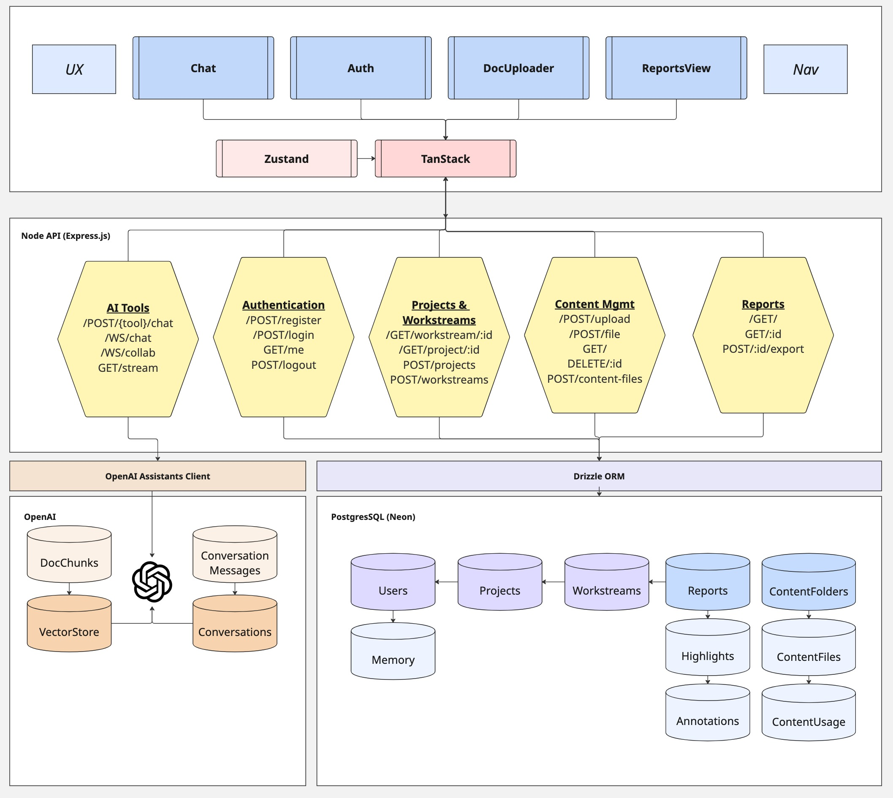

# 🚀 LOCA Hardening Sprint - Day 1 Documentation

## 📋 Table of Contents

### 🎯 Sprint Overview
- [Day 1 Goals](#day-1-goals)
- [Strategic Alignment](#strategic-alignment)
- [Quick Links](#quick-links)

### 🏗️ System Architecture
- [Platform Overview](#platform-overview)
  - [Infrastructure Status](#infrastructure-status)
  - [Current Limitations](#current-limitations)
  - [Technical Debt](#technical-debt)
- [Technical Stack](#technical-stack)
  - [Frontend Layer (React)](#frontend-layer-react)
  - [API Layer (Node/Express)](#api-layer-nodeexpress)
  - [Data Layer (PostgreSQL)](#data-layer-postgresql)
  - [AI Integration](#ai-integration)
- [Product Portfolio](#product-portfolio)
  - [Troublemaker](#troublemaker)
  - [Centarchetype](#centarchetype)
  - [Future Products](#future-products)

### 🎯 Strategic Questions & Roadmap
- [How Might We...](#how-might-we)
  - [Cost Modeling](#1-model-costs-with-depth)
  - [Workarounds & Trade-offs](#2-workarounds)
  - [Content Strategy](#3-turn-this-into-a-blog-post-worth-reading)
  - [Re-architecture Plans](#4-re-architect-the-architect)
- [Technical Investigation](#technical-investigation)
  - [Priority 1: Access & Workflow](#priority-1-access--workflow)
  - [Priority 2: Understanding the Stack](#priority-2-understanding-the-stack)
  - [Priority 3: Risk Assessment](#priority-3-risk-assessment)

### 📊 Operational Concerns
- [Known Issues](#known-issues)
- [Missing Infrastructure](#missing-infrastructure)
- [Next Steps](#next-steps)

### 📚 Additional Resources
- [System Architecture Diagram](troublemaker-stack.jpg)
- [Miro Board](https://miro.com/app/board/uXjVJUai5AM=/?share_link_id=173437609)
- [Detailed Architecture Documentation](ARCHITECTURE.md)
- [Strategic Planning & Questions](STRATEGY.md)

---

## 🎯 Day 1 Goals

### Ford's Specific Tasks
- ✅ **Produce diagrams and narrations on system architecture**
  - See diagram [in Miro](https://miro.com/app/board/uXjVJUai5AM=/?share_link_id=173437609)
  - 
- 🔄 **Begin cloning or creating a test environment**
- 🔍 **Identify integration points, core components, and potential drift by code review**

### Strategic Alignment
Day 1 focuses on **understanding and documentation** (Appeal/Brand pillar of the PROVE framework)

---

## 🏗️ System Architecture

> **Note**: For complete technical details, see [ARCHITECTURE.md](ARCHITECTURE.md)

### Platform Overview

#### Infrastructure Status
- **Hosting**: Repl.it (single production environment)
- **Deployment**: Preview-to-production pipeline (CEO-managed)
- **Region**: Single region deployment
- **Environment**: Production only (no staging/dev)

#### Current Limitations
- ❌ No automated backups
- ❌ No comprehensive logging
- ❌ No monitoring/alerting
- ❌ No rollback capability
- ❌ No multi-tenancy
- ❌ No subscription/payment processing
- ❌ No automated testing framework

#### Technical Debt
- Chat memory persistence issues
- Performance bottlenecks in report generation
- Single-point-of-failure deployment model
- Inefficient context building in Centarchetype
- Slow generation times

### Technical Stack

#### Frontend Layer (React)
- **State Management**: Zustand (local) + TanStack Query (server sync)
- **Build Tool**: Vite
- **Styling**: PostCSS
- **Core Components**:
  - Chat Interface
  - Authentication System
  - Document Uploader
  - Reports Dashboard
  - Navigation Suite

#### API Layer (Node/Express)
Five microservice groups:
1. **AI Tools** - OpenAI Assistants API integration
2. **Authentication** - User account operations
3. **Projects & Workstreams** - Project lifecycle management
4. **Content Management** - Upload and usage tracking
5. **Reports** - Generation, highlighting, annotations

#### Data Layer (PostgreSQL)
- **Database**: Neon Managed PostgreSQL
- **ORM**: DrizzleORM
- **Tables**: 10 core tables
- **Vector Storage**: Embeddings for AI context

#### AI Integration
- **Primary**: OpenAI Assistants API
- **Models**: GPT-5, Opus (Claude)
- **Vector Stores**: 4 underlying databases
- **Context Management**: Conversations linked to ConversationMessages

---

## 🎯 Strategic Questions & Roadmap

> **Note**: For complete strategic planning, see [STRATEGY.md](STRATEGY.md)

### How Might We...

#### 1. Model costs with depth
- Analyze variable vs fixed costs
- Review existing billing patterns
- Explore enterprise support options

#### 2. Workarounds
- GitHub and Projects as temporary solutions
- SSO implementation trade-offs
- 5-day sprint constraints

#### 3. Turn this into a blog post worth reading
- Document problems with current infrastructure
- Articulate migration goals clearly
- Create compelling narrative

#### 4. Re-architect the architect
- Design multi-environment setup
- Implement multi-tenancy
- Add payment and subscription systems

### Technical Investigation

#### Priority 1: Access & Workflow
- How do I work?
- How do we work?
- Do I have access?

#### Priority 2: Understanding the Stack
- What does Replit do?
- How does OpenAI Assistants work?
- What is TanStack vs Zustand?
- What is Vite and hot module replacement?
- Where is the source of truth?

#### Priority 3: Risk Assessment
- Where is this brittle?
- Where could it break?
- Is this secure?
- How do we make incremental changes?

---

## 📊 Product Portfolio

### Troublemaker
**30-minute strategic intelligence engine**

#### Core Value Proposition
Transforms business context into bespoke market research reports through AI-powered external data synthesis and Socratic dialogue refinement.

#### User Journey
```
Chat Initiation → AI Intelligence Gathering → Report Generation → 
Interactive Highlighting → Socratic Analysis → Business Concepts
```

#### Known Issues
- Contextual memory loss in chat sessions
- Timing and performance bottlenecks
- Single-environment fragility affecting all users

### Centarchetype
**Brand personality and content generation platform**

#### Function
Socratic dialogue-driven brand definition with aligned copywriting and editing capabilities.

#### Current Status
- Architecture incomplete (see [NARRATIVE_IN_CENTAURCHETYPE](NARRATIVE_IN_CENTAURCHETYPE))
- Slow generation speeds
- Inefficient context building
- Minor bugs in workflow

### Future Products
- 3 additional products in roadmap
- Focus on enterprise-grade features
- Comprehensive monitoring systems planned

---

## 📊 Operational Concerns

### Known Issues
1. **Infrastructure**
   - Single point of failure
   - No disaster recovery
   - Manual deployment process
   
2. **Performance**
   - Report generation bottlenecks
   - Chat memory persistence
   - Context building inefficiencies

3. **Security**
   - No security audit completed
   - Authentication scoping limitations
   - No compliance framework

### Missing Infrastructure
- ❌ Automated testing framework
- ❌ Centralized prompt management
- ❌ Multi-tenancy architecture
- ❌ Subscription and payment processing
- ❌ Monitoring and alerting
- ❌ Backup and recovery systems
- ❌ CI/CD pipeline

### Next Steps

#### Immediate Priorities
1. **Troublemaker optimization** and bug resolution
2. **Centarchetype architecture** definition
3. **Performance enhancement** initiatives
4. **Test environment** setup

#### Sprint Goals
- Complete system documentation
- Identify all integration points
- Map technical debt
- Create migration plan
- Establish testing framework

#### Long-term Roadmap
- Migrate to enterprise infrastructure
- Implement comprehensive monitoring
- Add multi-tenancy support
- Launch 3 additional products
- Establish DevOps best practices

---

## 📚 Additional Resources

### Documentation
- [ARCHITECTURE.md](ARCHITECTURE.md) - Detailed technical architecture
- [STRATEGY.md](STRATEGY.md) - Strategic questions and planning
- [NARRATIVE_IN_CENTAURCHETYPE](NARRATIVE_IN_CENTAURCHETYPE) - Centarchetype documentation (to be completed)

### Visual Resources
- [System Architecture Diagram](troublemaker-stack.jpg)
- [Miro Board - Live Diagrams](https://miro.com/app/board/uXjVJUai5AM=/?share_link_id=173437609)

### Quick Reference
- **Stack**: React + Node/Express + PostgreSQL
- **Hosting**: Repl.it
- **AI**: OpenAI Assistants API
- **Database**: Neon PostgreSQL
- **State**: Zustand + TanStack Query

---

*Last Updated: Day 1 of LOCA Hardening Sprint*