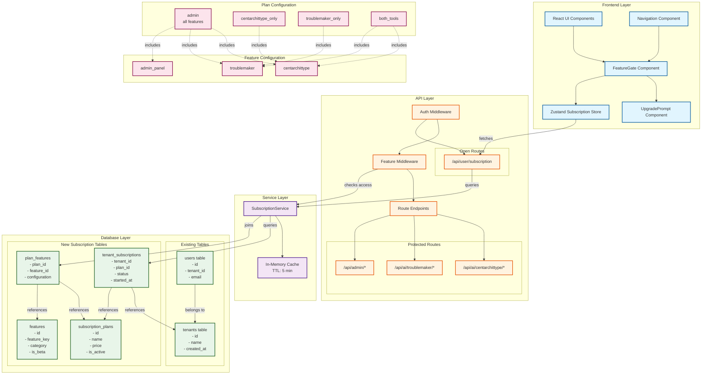

```mermaid
graph TB
   subgraph "Frontend Layer"
       UI[React UI Components]
       FG[FeatureGate Component]
       UP[UpgradePrompt Component]
       NAV[Navigation Component]
       STORE[Zustand Subscription Store]
       
       UI --> FG
       FG --> UP
       NAV --> FG
       FG --> STORE
   end
   
   subgraph "API Layer"
       AUTH[Auth Middleware]
       FM[Feature Middleware]
       RE[Route Endpoints]
       
       subgraph "Protected Routes"
           CENT["/api/ai/centarchittype/*"]
           TROUBLE["/api/ai/troublemaker/*"]
           ADMIN["/api/admin/*"]
       end
       
       subgraph "Open Routes"
           SUBAPI["/api/user/subscription"]
       end
       
       AUTH --> FM
       FM --> RE
       RE --> CENT
       RE --> TROUBLE
       RE --> ADMIN
       AUTH --> SUBAPI
   end
   
   subgraph "Service Layer"
       SS[SubscriptionService]
       CACHE[In-Memory Cache<br/>TTL: 5 min]
       
       SS --> CACHE
   end
   
   subgraph "Database Layer"
       subgraph "Existing Tables"
           TENANTS[tenants table<br/>- id<br/>- name<br/>- created_at]
           USERS[users table<br/>- id<br/>- tenant_id<br/>- email]
       end
       
       subgraph "New Subscription Tables"
           PLANS[subscription_plans<br/>- id<br/>- name<br/>- price<br/>- is_active]
           FEATURES[features<br/>- id<br/>- feature_key<br/>- category<br/>- is_beta]
           PF[plan_features<br/>- plan_id<br/>- feature_id<br/>- configuration]
           TS[tenant_subscriptions<br/>- tenant_id<br/>- plan_id<br/>- status<br/>- started_at]
       end
       
       USERS -->|belongs to| TENANTS
       TS -->|references| TENANTS
       TS -->|references| PLANS
       PF -->|references| PLANS
       PF -->|references| FEATURES
   end
   
   %% Data Flow
   STORE -->|fetches| SUBAPI
   SUBAPI -->|queries| SS
   FM -->|checks access| SS
   SS -->|queries| TS
   SS -->|joins| PF
   
   %% Feature Configuration
   subgraph "Feature Configuration"
       F1[centarchittype]
       F2[troublemaker]
       F3[admin_panel]
   end
   
   subgraph "Plan Configuration"
       P1[admin<br/>all features]
       P2[centarchittype_only]
       P3[troublemaker_only]
       P4[both_tools]
   end
   
   P1 -.->|includes| F1
   P1 -.->|includes| F2
   P1 -.->|includes| F3
   P2 -.->|includes| F1
   P3 -.->|includes| F2
   P4 -.->|includes| F1
   P4 -.->|includes| F2
   
   classDef frontend fill:#e1f5fe,stroke:#01579b,stroke-width:2px
   classDef api fill:#fff3e0,stroke:#e65100,stroke-width:2px
   classDef service fill:#f3e5f5,stroke:#4a148c,stroke-width:2px
   classDef database fill:#e8f5e9,stroke:#1b5e20,stroke-width:2px
   classDef feature fill:#fce4ec,stroke:#880e4f,stroke-width:2px
   
   class UI,FG,UP,NAV,STORE frontend
   class AUTH,FM,RE,CENT,TROUBLE,ADMIN,SUBAPI api
   class SS,CACHE service
   class TENANTS,USERS,PLANS,FEATURES,PF,TS database
   class F1,F2,F3,P1,P2,P3,P4 feature
```