# Security Audit Framework
## Network Assessment & Control Evaluation

### 🔒 **Network Architecture Overview**

```mermaid
graph TD
    subgraph "External Access"
        Users[👥 User Devices]
        Auditors[🔍 External Auditors]
        Threats[⚠️ Threat Vectors]
    end
    
    subgraph "Network 1: Development Environment"
        ReplitEnv[🛠️ Repl.it Platform]
        AppCode[📱 Application Code]
        DevTools[🔧 Development Tools]
        PreviewDeploy[🚀 Preview Deployment]
    end
    
    subgraph "Network 2: Data & API Layer"
        NeonDB[🗄️ Neon PostgreSQL]
        OpenAIAPI[🤖 OpenAI API]
        ExternalAPIs[🌐 External Data Sources]
        VectorStores[🎯 Vector Databases]
    end
    
    subgraph "Network 3: Operations & Support"
        Logs[📋 System Logs]
        Monitoring[📊 Health Monitoring]
        Backups[💾 Backup Systems]
        Alerts[🚨 Alert Systems]
    end
    
    %% Connections with Security Labels
    Users -.->|"🔐 MFA Required?"| ReplitEnv
    Users -.->|"🔒 HTTPS/TLS"| AppCode
    
    ReplitEnv -->|"🔑 API Keys Secure?"| NeonDB
    ReplitEnv -->|"🛡️ Rate Limited?"| OpenAIAPI
    AppCode -->|"📊 Audit Trail?"| Logs
    
    NeonDB -.->|"🔐 Encrypted at Rest?"| Backups
    ExternalAPIs -.->|"🚦 Network Segmentation?"| Monitoring
    
    Threats -.->|"🛑 IDS/IPS?"| ReplitEnv
    Threats -.->|"🔍 Vulnerability Scanning?"| NeonDB
    
    %% Styling
    classDef external fill:#ffebee
    classDef network1 fill:#e3f2fd
    classDef network2 fill:#e8f5e8
    classDef network3 fill:#fff3e0
    classDef security fill:#f3e5f5
    
    class Users,Auditors,Threats external
    class ReplitEnv,AppCode,DevTools,PreviewDeploy network1
    class NeonDB,OpenAIAPI,ExternalAPIs,VectorStores network2
    class Logs,Monitoring,Backups,Alerts network3
```

---

### 🛡️ **Security Control Assessment Matrix**

#### **1. Access & Identity Management**

| Control Area | Current State | Risk Level | Action Required |
|-------------|---------------|------------|-----------------|
| **Account Provisioning** | CEO manual deployment | 🔴 High | Implement automated IAM |
| **Shared Accounts** | Unknown status | 🟡 Medium | Audit and eliminate shared credentials |
| **MFA Enforcement** | Not verified | 🔴 High | Enforce MFA for all admin access |
| **API Key Management** | Stored in Repl.it | 🟡 Medium | Implement secure key vault |
| **Password Policies** | Platform defaults | 🟡 Medium | Define and enforce strong policies |

#### **2. Network Security & Segmentation**

| Control Area | Current State | Risk Level | Action Required |
|-------------|---------------|------------|-----------------|
| **Network Isolation** | Limited segmentation | 🟡 Medium | Implement logical network boundaries |
| **Traffic Filtering** | Platform-managed | 🟡 Medium | Define ingress/egress rules |
| **Cross-Network Access** | Unrestricted | 🔴 High | Implement least-privilege access |
| **Intrusion Detection** | Not implemented | 🔴 High | Deploy network monitoring |

#### **3. Data Protection**

| Control Area | Current State | Risk Level | Action Required |
|-------------|---------------|------------|-----------------|
| **Encryption at Rest** | Database provider managed | 🟢 Low | Verify encryption standards |
| **Encryption in Transit** | HTTPS/TLS | 🟢 Low | Maintain current standards |
| **Data Classification** | Not defined | 🟡 Medium | Classify and label sensitive data |
| **Access Logging** | Limited | 🔴 High | Implement comprehensive audit logging |

#### **4. Application Security**

| Control Area | Current State | Risk Level | Action Required |
|-------------|---------------|------------|-----------------|
| **Environment Isolation** | Single Repl.it instance | 🔴 High | Implement multi-environment strategy |
| **Dependency Management** | Manual updates | 🟡 Medium | Automate vulnerability scanning |
| **Code Security** | No static analysis | 🟡 Medium | Implement SAST/DAST tools |
| **Service Hardening** | Default configurations | 🟡 Medium | Review and harden all services |

#### **5. Incident Response & Monitoring**

| Control Area | Current State | Risk Level | Action Required |
|-------------|---------------|------------|-----------------|
| **Log Management** | No centralized logging | 🔴 High | Implement centralized log management |
| **Log Retention** | Platform default | 🟡 Medium | Define retention policies |
| **Incident Response Plan** | Not documented | 🔴 High | Develop and test IR procedures |
| **Security Monitoring** | Reactive only | 🔴 High | Implement proactive monitoring |

#### **6. Business Continuity**

| Control Area | Current State | Risk Level | Action Required |
|-------------|---------------|------------|-----------------|
| **Backup Strategy** | No regular backups | 🔴 High | Implement automated backup system |
| **Disaster Recovery** | No documented plan | 🔴 High | Develop and test DR procedures |
| **Service Redundancy** | Single point of failure | 🔴 High | Implement redundancy for critical services |
| **Recovery Testing** | Never performed | 🔴 High | Schedule regular recovery drills |

---

### 📋 **Immediate Security Priorities**

#### **Critical (Address Immediately)**
1. **Implement MFA** for all administrative access
2. **Establish backup procedures** for all critical data
3. **Document incident response** procedures
4. **Enable comprehensive logging** across all systems

#### **High Priority (Next 30 Days)**
1. **Network segmentation** implementation
2. **API key security** audit and remediation
3. **Vulnerability scanning** automation
4. **Access control** review and tightening

#### **Medium Priority (Next 90 Days)**
1. **Data classification** and protection standards
2. **Security monitoring** platform deployment
3. **Disaster recovery** plan development
4. **Security awareness** training program

---

### 🔍 **Audit Questions Checklist**

#### **For Management**
- [ ] Who is responsible for security oversight?
- [ ] What is the budget for security improvements?
- [ ] How often are security reviews conducted?
- [ ] What compliance requirements must be met?

#### **For Technical Teams**
- [ ] How are production deployments managed?
- [ ] What monitoring tools are currently in use?
- [ ] How are security patches applied?
- [ ] What is the current backup and recovery process?

#### **For External Auditors**
- [ ] Can you provide evidence of access controls?
- [ ] Where are security logs stored and retained?
- [ ] How do you handle security incidents?
- [ ] What third-party security assessments have been conducted?

---

### 📊 **Risk Summary Dashboard**

| Risk Category | Critical | High | Medium | Low | Total |
|---------------|----------|------|---------|-----|-------|
| Access Control | 2 | 1 | 2 | 0 | 5 |
| Network Security | 1 | 1 | 2 | 0 | 4 |
| Data Protection | 0 | 1 | 1 | 2 | 4 |
| Application Security | 1 | 0 | 3 | 0 | 4 |
| Monitoring | 0 | 4 | 1 | 0 | 5 |
| Business Continuity | 0 | 4 | 0 | 0 | 4 |
| **TOTALS** | **4** | **11** | **9** | **2** | **26** |

**Overall Risk Score: 🔴 HIGH** - Immediate action required across multiple control areas.
